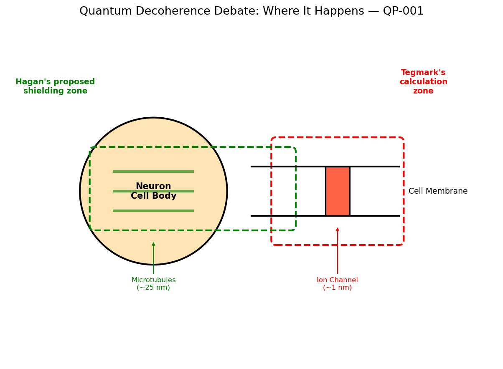
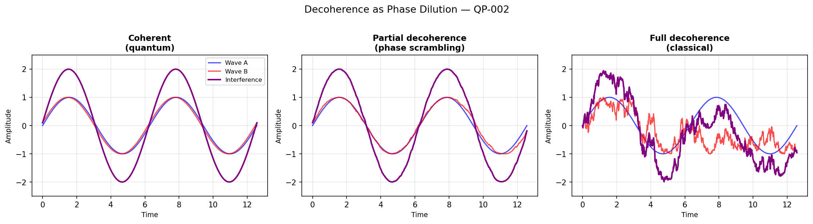
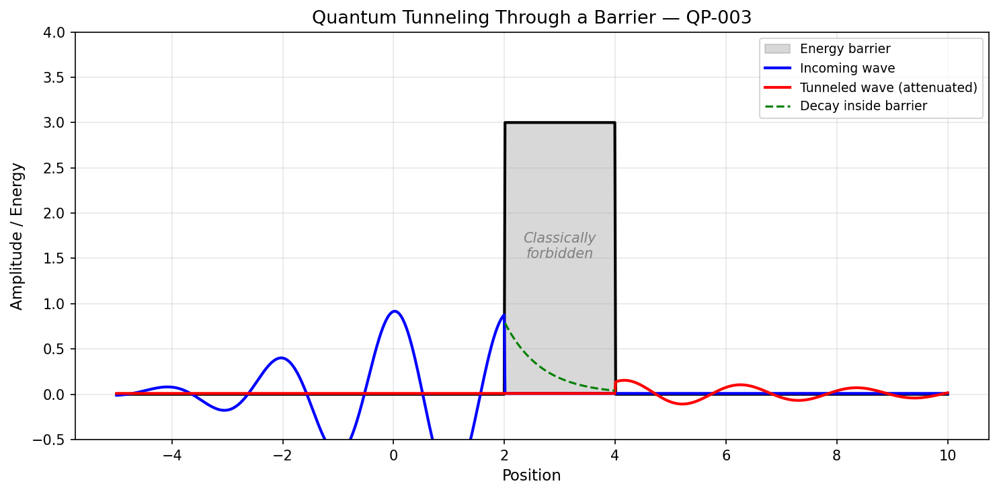
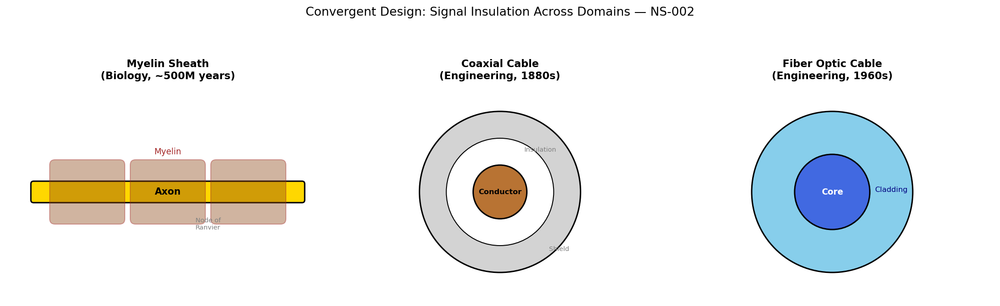

# QI Field Journal

> Running Q&A learning journal — Kevin Qi exploring quantum physics, neuroscience, neuroethics, and the spaces between.

## How This Works

- Each entry: Kevin's question (in his voice) + detailed answer + related reading
- Organized by topic domain with cross-references
- Append-only — the journal only grows
- Visualizations auto-generated on commit (see `.github/workflows/fieldjournal-viz.yml`)

---

## Quantum Physics

### Entry QP-001: What is Tegmark's decoherence calculation? (2026-02-03)

**Question:** What is Tegmark again? It proves quantum decoherence... explain this in my terms.

**Answer:** In 2000, physicist Max Tegmark published a calculation showing that quantum effects in the brain — superposition, entanglement, tunneling — collapse into classical physics in approximately 10⁻¹³ seconds (0.1 picoseconds). His argument: the brain is too warm, too wet, and too noisy for quantum states to survive at cognitive timescales.

Tegmark modeled two scenarios:
1. **Ions (Na⁺, K⁺) in superposition** inside ion channels — decoherence in ~10⁻²⁰ seconds
2. **Neurotransmitter molecules in superposition** crossing the synaptic cleft — decoherence in ~10⁻²⁰ to 10⁻¹³ seconds

If Tegmark is completely right, the quantum terms in the QI equation go to zero. No quantum biometric, no entanglement-based security, no Zeno-BCI effect. But QIF still works — the coherence metric is classical signal processing, the hourglass architecture describes real BCI interfaces, the threat taxonomy maps real attack surfaces, and the neuroethics questions remain valid.

Key counterarguments:
- **Hagan, Hameroff, Tuszynski (2002):** Recalculated with microtubule shielding → decoherence times 7 orders of magnitude longer (microseconds vs. femtoseconds)
- **Fisher (2015–2025):** Posner molecules may preserve quantum coherence for hours in biological systems
- **Dewan (2024):** Quadratic (not exponential) decoherence at short timescales

The QIF framework treats decoherence time as a tunable dial. Set it to Tegmark's value → classical BCI security framework. Set it to Fisher's value → quantum security activates.

**Related:** QIF-TRUTH.md (decoherence parameter), QIF-WHITEPAPER.md (Section III), Tegmark 2000 (Physical Review E)
**Visualization:** 

---

### Entry QP-002: Does decoherence mean collapse or wave interference? (2026-02-03)

**Question:** Does it collapse or is it moved because of interference from other waves?

**Answer:** Kevin's instinct is closer to the real physics than the word "collapse" suggests.

**"Collapse" (old view, Copenhagen interpretation):** The quantum state pops from superposition into a definite state. Instantaneous, discrete. Misleading.

**What actually happens (modern decoherence theory):** The phase relationships get scrambled by interaction with surrounding waves, particles, and thermal vibrations. It IS interference — specifically, the destruction of coherent interference patterns.

**Analogy:** A quantum superposition is like two waves perfectly in sync creating an interference pattern — that pattern IS the "quantumness." Flood the environment with billions of other waves (thermal vibrations, water molecules, EM noise), each introducing random phase shifts. The original interference pattern doesn't "collapse" — it gets **drowned out**. The information spreads across so many interactions it becomes practically unrecoverable.

**Decoherence is not destruction. It is dilution.**

"Moved because of interference from other waves" is a more physically accurate description than "collapse." This connects directly to the QIF coherence metric, which measures phase variance — how much the interference pattern has been disrupted. Higher phase variance (σ²ᵩ) = more decoherence = lower coherence score.

**Related:** QIF coherence metric (Cₛ = e^(−(σ²ᵩ + σ²τ + σ²ᵧ))), Zurek 2003 (decoherence theory), Schlosshauer 2007 (Decoherence and the Quantum-to-Classical Transition)
**Visualization:** 

---

### Entry QP-003: If microtubules are shields, can quantum tunneling pass through them? (2026-02-03)

**Question:** They proposed microtubules — protein structures inside neurons — as potential quantum shields. But we know in quantum tunneling that particles can move through walls. Has science tested the experiment using microtubules?

**Answer:** This mixes two different quantum phenomena, and untangling them is important:

**Quantum tunneling** = a particle passing through an energy barrier it classically cannot cross. Depends on barrier width, height, and particle mass. Electrons tunnel easily; water molecules (much heavier) tunnel far less.

**Decoherence** = quantum states losing their "quantumness" because the environment interacts with them. Not about particles escaping — about phase information leaking out.

The microtubule shielding idea is NOT about keeping particles physically contained. It's about creating an interior environment with less thermal noise — ordered water, hydrophobic pockets, geometric structure — so quantum states survive longer. Tunneling *through* the microtubule wall isn't the threat; the threat is the warm, wet environment constantly "poking" the quantum state and scrambling its phase.

**Experimental status:**
- **Anirban Bandyopadhyay** (NIMS, Japan): Reported quantum-like oscillations in tubulin proteins. Suggestive but controversial, not widely replicated.
- **Travis Craddock et al.:** Computational modeling of quantum states in tubulin dimers — simulations only, no wet lab.
- **Hameroff & Penrose (Orch-OR theory):** Proposed testable predictions, but the critical experiment — directly measuring quantum coherence *inside* a microtubule in living tissue — has not been done. The instrumentation is extraordinarily difficult.

**Status:** Not proven, not disproven, not mainstream.

**Related:** Hagan et al. 2002, Hameroff & Penrose 2014 (Orch-OR review), Bandyopadhyay 2020, Entry QP-001 (Tegmark)
**Visualization:** 

---

## Neuroscience

### Entry NS-001: Are myelin sheaths related to Tegmark's work? (2026-02-03)

**Question:** I have a strong feeling it's irrefutable. Is Tegmark's related to the myelin receptors on the neurons that are between them?

**Answer:** Not exactly. Tegmark's calculation targets two specific quantum scenarios — ions in superposition inside ion channels, and neurotransmitters in superposition crossing the synaptic cleft. Both happen at the nanometer scale.

**Myelin sheaths** wrap around axons (the long output cables of neurons) to insulate electrical signals and speed them up. They operate at the millimeter scale — orders of magnitude larger than Tegmark's quantum scenarios. Myelin is about classical signal *propagation*, not about quantum states at synapses or ion channels.

The counterargument to Tegmark comes from **microtubules** (not myelin) — protein structures inside the neuron body that Hagan, Hameroff, and Tuszynski proposed could shield quantum states from thermal noise. Microtubules operate at the nanometer scale (same as Tegmark's scenarios).

**The distinction:**
| Structure | Scale | Function | Quantum relevance |
|-----------|-------|----------|-------------------|
| Myelin sheath | ~1 mm | Insulates axon signal propagation | Classical — speeds up action potentials |
| Microtubule | ~25 nm | Structural skeleton inside neurons | Proposed quantum shield (controversial) |
| Ion channel | ~1 nm | Opens/closes for ion flow | Where Tegmark calculated decoherence |

The scientific consensus leans toward Tegmark. Most physicists and neuroscientists think quantum effects decohere too fast. Fisher's Posner molecule work is the strongest challenge but remains preliminary. Critically, nobody has calculated decoherence at a **platinum-neural membrane junction** (the BCI interface) — which is genuinely uncharted territory and a core QIF contribution.

**Related:** Tegmark 2000, Hagan et al. 2002, Entry QP-001, QIF-TRUTH.md (spatial extents by band)
**Visualization:** 

---

### Entry NS-002: Did myelin sheaths inspire fiber optic cables? (2026-02-03)

**Question:** Is myelin sheaths where we got the idea of fiber optic cables or unrelated?

**Answer:** Unrelated historically, but convergent solutions to the same engineering problem: **how to transmit a signal over distance without degradation**.

**Myelin sheath:**
- Insulating sheath around nerve axons
- Prevents signal leakage (ion current dissipation)
- Speeds transmission by forcing signals to "jump" between nodes of Ranvier (saltatory conduction)
- Evolved over hundreds of millions of years
- Failure = multiple sclerosis, Guillain-Barré syndrome

**Fiber optic cable:**
- Glass core with cladding of different refractive index
- Total internal reflection keeps light contained
- Developed from 1950s–60s optics research, based on physics from the 1840s (Snell's law, total internal reflection)
- No biological inspiration — pure physics and engineering

**The closer analogy:** The engineering equivalent of myelin is actually **coaxial cable** — a conducting core wrapped in insulation wrapped in a shield. This is almost exactly what myelin does for an axon. Coaxial cable design (1880s, Oliver Heaviside) predates understanding of myelin's function.

**The deeper insight:** Biology and engineering converge on the same architectures because physics constrains the design. Signal insulation is a universal problem — evolution and engineering both arrive at "wrap the conductor in insulation." This pattern — convergent design across domains — is exactly the kind of cross-disciplinary connection that QIF is built to recognize.

**Related:** Entry NS-001 (myelin structure), QIF hourglass architecture (signal propagation across domains)
**Visualization:** 

---

## Neuroethics

*(Future entries)*

---

## Cross-Domain Connections

*(Future entries linking concepts across domains)*

---

*Part of the [QIF Project](https://github.com/qinnovates/mindloft) — Quantum Intelligence Field Journal*
*Started: 2026-02-03*
*Entries: 5 (QP: 3, NS: 2)*
